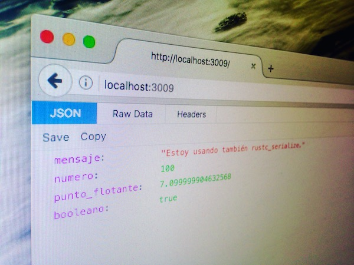

# Hello JSON
### JSON Response con Rust y Iron

Basado en el ejemplo del artículo ["Writing a basic JSON response web server in Rust using Iron"](https://www.jamestease.co.uk/blether/writing-a-basic-json-web-server-in-rust-using-iron) por James Stease.

Esta versión ha sido modificada y comentada para fines de aprendizaje. Varios comentarios han sido agregados para describir la finalidad de cada parte del código.

Lee directamente el código fuente comentado en el archivo [main.rs](src/main.rs).

Puedes clonar este ejemplo en una terminal con:

    git clone git@github.com:aio00/hello-json.git

Entra al directorio hello_json:

    cd hello_json

Para bajar dependencias, compilar y ejecutar, usa _cargo_:

    cargo run

Si no hay un error, podrás ver el servicio en tu navegador web en la dirección http://localhost:3009/

